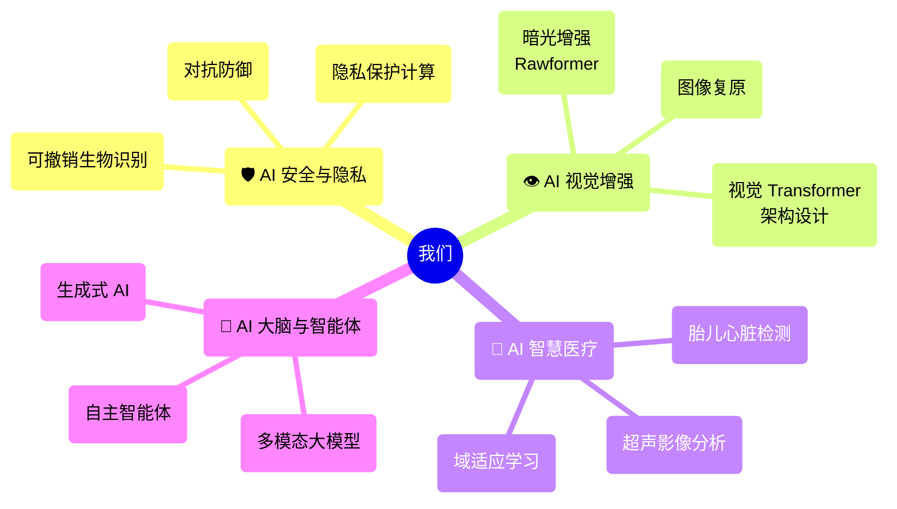

I am currently an Associate Professor at [Anhui University](https://en.ahu.edu.cn/), Hefei, China, and also affiliated as a Researcher/PI with Tian-Hai Flow Control Co., LTD. Previously, I was a Postdoctoral Researcher at [Yonsei University](https://www.yonsei.ac.kr/), Seoul, Korea, under the supervision of [Prof. Andrew Teoh](https://scholar.google.com/citations?user=ueRkvQMAAAAJ&hl=en). My research there was funded by the South Korea Brain Pool (BP) Program, and my research at Monash was funded by the MARIE SKŁODOWSKA-CURIE Fellowship. I am proud to be a BP and MSCA fellowship awardee. My research expertise lies in **image processing** (both medical and natural), **deep learning**, **computer vision**, **pattern recognition**,  and **privacy protection**. 

I earned my Ph.D. degree from the Faculty of Information Technology, **[Monash University](https://monash.edu/)**, and my B.Sc. degree with the National Training Base for Life Science and Technology Talents program at **[Huazhong Agricultural University](http://www.hzau.edu.cn/)**. I was briefly enrolled as a Ph.D. student in molecular metabolism at Virginia Tech, USA. Since 2024, I have been a Editor/Guest Editor for several SCI journals and have served as an Area Chair (AC) for BMVC. Please feel free to use my [Public PGP Key](/files/publicPGP.asc) when you email me if you are interested in privacy protection.

I am proudly a participant in a charity project called [**蓝信封行动 (Blue Letter Project)**](http://www.lanxinfeng.org/), which supports children left behind in rural areas💖💖. I was interviewed about my involvement, and you can read the interview [here](https://mp.weixin.qq.com/s/bo23lhRF_RxtpezyHff_mQ).

## 🌟 Join Us! 做有温度、有深度的科研

### 🚀 我们的四大核心研究方向 (Research Pillars)

#### 1. **AI 护盾：生物特征识别与安全 (Biometric Security & Privacy)**
> *"在这个刷脸的时代，谁来保护你的‘脸’？"*
- **核心黑科技**：**可撤销生物识别 (Cancelable Biometrics)**, 隐私保护人脸识别, 生物加密系统。
- **我们在做什么**：设计能够抵御黑客攻击的“加密人脸”和“加密指纹”。即使数据库泄露，你的真实生物特征依然安全！这是信息安全领域的“防弹衣”。
- **Target**: CVPR, TIFS, T-Biom.

#### 2.  **AI 鹰眼：计算摄影与暗光增强 (Computational Photography & Enhancement)**
> *"让黑夜如白昼，让模糊变清晰。"*
- **核心黑科技**：**暗光增强 (Low-light Enhancement)**, 图像复原, Rawformer (基于Transformer的原始图像处理)。
- **我们在做什么**：利用深度学习让手机在伸手不见五指的黑夜拍出清晰大片，修复老旧照片，提升监控画质。
- **Target**: CVPR, ICCV, ECCV, TIP.

#### 3.  **AI 医者：医学影像分析 (Medical AI)**
> *"AI 辅助诊断，守护生命健康。"*
- **核心黑科技**：**超声图像分析 (Ultrasound Analysis)**, 胎儿心脏结构检测, 无监督域适应。
- **我们在做什么**：教 AI 看懂复杂的 B 超图像，自动检测胎儿心脏异常，辅助医生进行早期诊断。做有温度的技术！
- **Target**: MICCAI, TMI, JBHI.

#### 4.  **AI 大脑：大模型与智能体 (Large Models & Agents)**
> *"赋予 AI 思考与自主决策的灵魂。"*
- **核心黑科技**：**多模态大模型 (MLLM)**, **自主智能体 (Autonomous Agents)**, Generative AI.
- **我们在做什么**：不仅仅是识别图像，我们让 AI 学会像人一样思考、规划和行动。将视觉 (Vision) 与语言 (Language) 结合，打造能够理解意图并自动执行任务的下一代智能体（Agent）。
- **Target**: NeurIPS, ICLR, CVPR.

---

### 🗺️ 研究方向全景图 (The Landscape)

---

### 📚 代表性科研成果 (Selected Publications)

课题组近年来在计算机视觉、人工智能、信息安全等领域的顶级国际会议和期刊上发表高水平学术论文 **70 余篇**，Google Scholar 总引用近 **1000 次**。我们的研究成果不仅发表在顶级刊物上，更在学术界产生了广泛影响：

*   **顶级会议 (Top Conferences)**:
    *   **CVPR (CCF-A)**: 发表多篇 Oral/Poster 论文，例如 *"Recurring the Transformer for Video Action Recognition"* (CVPR 2022) 和 *"Abandoning the Bayer-Filter to See in the Dark"* (CVPR 2022)，在视频理解与底层视觉领域提出创新方案。
    *   **AAAI，NIPS, ICML (CCF-A)**: 在目标跟踪，目标识别，模式识别领域发表多篇顶会。
    *   **MICCAI / IJCB**: 在医学影像分析 (Medical AI) 和生物特征识别 (Biometrics) 领域的顶级会议上均有重要成果发表。

*   **顶级期刊 (Top Journals)**:
    *   **IEEE T-IFS (CCF-A)**: 在信息安全与生物特征识别领域权威期刊发表多篇论文。
    *   **IEEE T-IM / JBHI**: 在医学影像顶级期刊发表多篇关于超声图像分析与辅助诊断的研究。
    *   **IEEE T-IP / T-MM**: 在图像处理与多媒体领域持续产出高质量研究成果。

---

### 💡 为什么选择我们？

1.  **顶会论文收割机**：我们在 CVPR, ICCV, TIFS等顶级会议和期刊上发表多篇高水平论文，手把手指导你发表第一篇顶会！老师会亲自指导，绝对不放养。
2.  **硬核技术落地**：从底层算法架构设计到具体的医疗/安全应用，既有理论深度，又有应用广度。
3.  **有趣有爱**：与其做一个无情的调参机器，不如来做保护隐私的黑客克星，或者辅助医生的 AI 专家，或者智能体的构建者！

**👉 欢迎计算机、数学、电子信息等相关专业的同学报考硕士/博士研究生！一起探索 AI 的无限可能！ (博士（电子信息），综合待遇保底5000/月，课题组可视情况额外补助，顶级科研成果奖励另算。名额有限，欢迎已经发表了高水平论文的同学提前联系！)**

 

