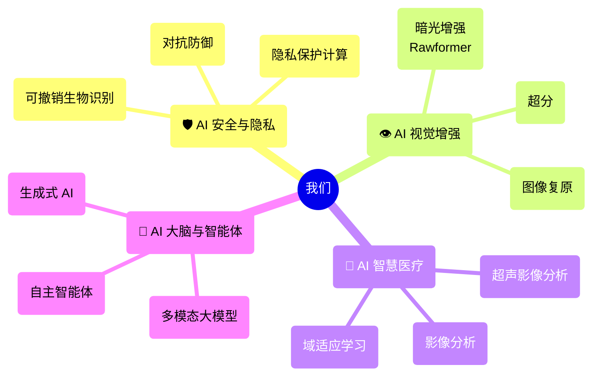

I am currently an Associate Professor at [Anhui University](https://en.ahu.edu.cn/), Hefei, China, and also affiliated as a Researcher/PI with Tian-Hai Flow Control Co., LTD. Previously, I was a Postdoctoral Researcher at [Yonsei University](https://www.yonsei.ac.kr/), Seoul, Korea, under the supervision of [Prof. Andrew Teoh](https://scholar.google.com/citations?user=ueRkvQMAAAAJ&hl=en). My research there was funded by the South Korea Brain Pool (BP) Program, and my research at Monash was funded by the MARIE SKŁODOWSKA-CURIE Fellowship. I am proud to be a BP and MSCA fellowship awardee. My research expertise lies in **image processing** (both medical and natural), **deep learning**, **computer vision**, **pattern recognition**,  and **privacy protection**. 

I earned my Ph.D. degree from the Faculty of Information Technology, **[Monash University](https://monash.edu/)**, and my B.Sc. degree with the National Training Base for Life Science and Technology Talents program at **[Huazhong Agricultural University](http://www.hzau.edu.cn/)**. I was briefly enrolled as a Ph.D. student in molecular metabolism at Virginia Tech, USA. Since 2024, I have been a Editor/Guest Editor for several SCI journals and have served as an Area Chair (AC) for BMVC. Please feel free to use my [Public PGP Key](/files/publicPGP.asc) when you email me if you are interested in privacy protection.

I am proudly a participant in a charity project called [**蓝信封行动 (Blue Letter Project)**](http://www.lanxinfeng.org/), which supports children left behind in rural areas💖💖. I was interviewed about my involvement, and you can read the interview [here](https://mp.weixin.qq.com/s/bo23lhRF_RxtpezyHff_mQ).

## Join Us! 
**👉 欢迎同学报考硕士研究生，申请博士研究生！一起探索 AI 的无限可能!博士综合待遇保底5000/月。金哲教授联合培养。所有硕博生课题组可视情况额外补助，顶级科研成果奖励另算。名额有限，先联系的可以提前锁定名额，欢迎同学提前联系！（微信:xdongcs）** 

### 我们的四大核心研究方向 (Research Pillars)

```mermaid
mindmap
  root((我们))
    Security(🛡️ AI 安全与隐私)
      Cancelable_Biometrics(可撤销生物识别)
      Privacy_Preserving(隐私保护计算)
      Adversarial_Defense(对抗防御)
    Vision(👁️ AI 视觉增强)
      Low_Light(暗光增强<br/>Rawformer)
      Restoration(图像复原)
      Super-resolution(超分)
    Medical(🏥 AI 智慧医疗)
      Ultrasound(超声影像分析)
      PET/MRI(影像分析)
      Domain_Adaptation(域适应学习)
    Brain(🧠 AI 大脑与智能体)
      MLLM(多模态大模型)
      Agents(自主智能体)
      AIGC(生成式 AI)
```

## 💡 为什么选择我们？

1.  **可呈现的论文成果**：我们在 CVPR, ICCV, TIFS等顶级会议和期刊上发表多篇高水平论文，访问[谷歌学术](https://scholar.google.com/citations?user=Jc4KdcIAAAAJ&hl=en)查看详细论文列表。
2.  **不放养**：会手把手指导你发表第一篇顶会！绝对不放养。也欢迎和支持有独立能力成员开展独立研究，绝不瞎指导。
3.  **给一作**：对有志于深造的同学的authorship，优先一作,积极支持同学的学术生涯发展。
4.  **有奖励**：达成顶级成果有奖励，并且逐年提高奖励金额。
5.  **硬核**：从底层算法架构设计到具体的医疗/安全应用，既有理论深度，又有应用广度。
6.  **有趣**：与其做一个无情的调参机器，不如来做保护隐私的黑客克星，或者辅助医生的 AI 专家，或者智能体的构建者！
7.  **好就业**：团队往届优秀毕业生就业于：头部985/欧美名校读博、组内读博、哔哩哔哩/科大讯飞研究院人才计划/中国人寿/比亚迪等高新企业、安徽工业经济职业技术学院等。综合薪资高达50W。
8.  **好沟通**：随时可以和老师沟通，一切皆可商量讨论。

 

