I am currently an Associate Professor at [Anhui University](https://en.ahu.edu.cn/), Hefei, China, and also affiliated as a Researcher/PI with Tian-Hai Flow Control Co., LTD. Previously, I was a Postdoctoral Researcher at [Yonsei University](https://www.yonsei.ac.kr/), Seoul, Korea, under the supervision of [Prof. Andrew Teoh](https://scholar.google.com/citations?user=ueRkvQMAAAAJ&hl=en). My research there was funded by the South Korea Brain Pool (BP) Program, and my research at Monash was funded by the MARIE SKŁODOWSKA-CURIE Fellowship. I am proud to be a BP and MSCA fellowship awardee. My research expertise lies in **image processing** (both medical and natural), **deep learning**, **computer vision**, **pattern recognition**,  and **privacy protection**. 

I earned my Ph.D. degree from the Faculty of Information Technology, **[Monash University](https://monash.edu/)**, and my B.Sc. degree with the National Training Base for Life Science and Technology Talents program at **[Huazhong Agricultural University](http://www.hzau.edu.cn/)**. I was briefly enrolled as a Ph.D. student in molecular metabolism at Virginia Tech, USA. Since 2024, I have been a Editor/Guest Editor for several SCI journals and have served as an Area Chair (AC) for BMVC. Please feel free to use my [Public PGP Key](/files/publicPGP.asc) when you email me if you are interested in privacy protection.

I am proudly a participant in a charity project called [**蓝信封行动 (Blue Letter Project)**](http://www.lanxinfeng.org/), which supports children left behind in rural areas💖💖. I was interviewed about my involvement, and you can read the interview [here](https://mp.weixin.qq.com/s/bo23lhRF_RxtpezyHff_mQ).

## Join Us! 
**👉 欢迎同学报考硕士研究生！一起探索 AI 的无限可能!1. 招收博士（电子信息专业），博士综合待遇保底5000/月。2. 所有硕博生课题组可视情况额外补助，顶级科研成果奖励另算。3. 欢迎同学提前联系！（微信:xdongcs）**

### 我们的四大核心研究方向 (Research Pillars)

```mermaid
mindmap
  root((我们))
    Security(🛡️ AI 安全与隐私)
      Cancelable_Biometrics(可撤销生物识别)
      Privacy_Preserving(隐私保护计算)
      Adversarial_Defense(对抗防御)
    Vision(👁️ AI 视觉增强)
      Low_Light(暗光增强<br/>Rawformer)
      Restoration(图像复原)
      Transformer(视觉 Transformer<br/>架构设计)
    Medical(🏥 AI 智慧医疗)
      Ultrasound(超声影像分析)
      Fetal_Heart(器官结构检测)
      Domain_Adaptation(域适应学习)
    Brain(🧠 AI 大脑与智能体)
      MLLM(多模态大模型)
      Agents(自主智能体)
      AIGC(生成式 AI)
```

## 1. **AI 护盾：生物特征识别与安全 (Biometric Security & Privacy)**
> *"在这个刷脸的时代，谁来保护你的‘脸’？"*
- **核心**：**可撤销生物识别 (Cancelable Biometrics)**, 隐私保护人脸识别, 生物加密系统。
- **我们在做什么**：设计能够抵御黑客攻击的“加密人脸”和“加密指纹”。即使数据库泄露，你的真实生物特征依然安全！这是信息安全领域的“防弹衣”。

## 2.  **AI 鹰眼：计算摄影与暗光增强 (Computational Photography & Enhancement)**
> *"让黑夜如白昼，让模糊变清晰。"*
- **核心**：**暗光增强 (Low-light Enhancement)**, 图像复原, Rawformer (基于Transformer的原始图像处理)。
- **我们在做什么**：利用深度学习让手机在伸手不见五指的黑夜拍出清晰大片，修复老旧照片，提升监控画质。

## 3.  **AI 医者：医学影像分析 (Medical AI)**
> *"AI 辅助诊断，守护生命健康。"*
- **核心**：**超声图像分析 (Ultrasound Analysis)**, 胎儿心脏结构检测, 无监督域适应。
- **我们在做什么**：教 AI 看懂复杂的 B 超图像，自动检测胎儿心脏异常，辅助医生进行早期诊断。做有温度的技术！

## 4.  **AI 大脑：大模型与智能体 (Large Models & Agents)**
> *"赋予 AI 思考与自主决策的灵魂。"*
- **核心**：**多模态大模型 (MLLM)**, **自主智能体 (Autonomous Agents)**, Generative AI.
- **我们在做什么**：不仅仅是识别图像，我们让 AI 学会像人一样思考、规划和行动。将视觉 (Vision) 与语言 (Language) 结合，打造能够理解意图并自动执行任务的下一代智能体（Agent）。

## 💡 为什么选择我们？

1.  **可呈现的论文**：我们在 CVPR, ICCV, TIFS等顶级会议和期刊上发表多篇高水平论文。会手把手指导你发表第一篇顶会！绝对不放养。也欢迎和支持有独立能力成员开展独立研究，绝不瞎指导。
2.  **硬核**：从底层算法架构设计到具体的医疗/安全应用，既有理论深度，又有应用广度。
3.  **有趣**：与其做一个无情的调参机器，不如来做保护隐私的黑客克星，或者辅助医生的 AI 专家，或者智能体的构建者！

 

